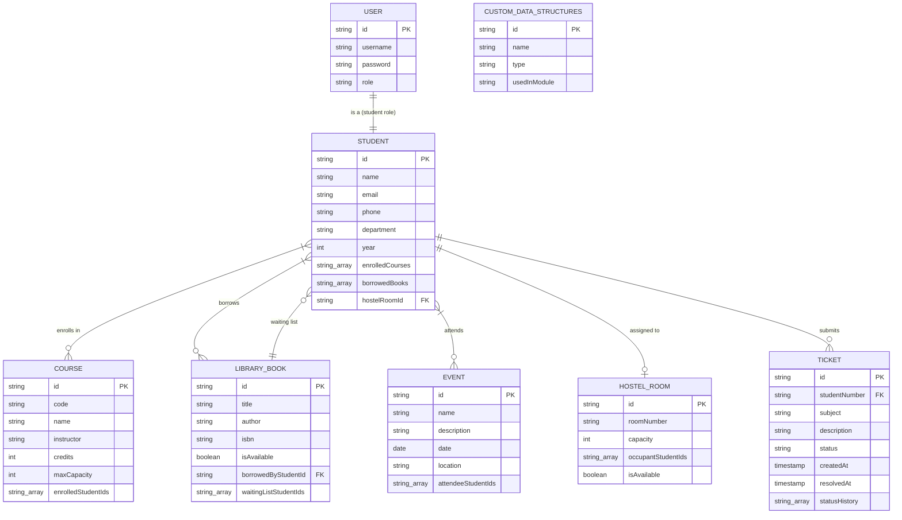

# Smart Campus Management System ERD


# Smart Campus Management System - Technical Design Document
## 1. Overview
The Smart Campus Management System is a comprehensive Java-based console application designed to streamline campus operations for educational institutions. The system provides role-based access for administrators and students, enabling efficient management of student records, course registration, library resources, hostel allocation, help-desk support, and event bookings.

This document outlines the technical architecture, data models, implementation strategy, and project organization for a menu-driven application that demonstrates proficiency in object-oriented programming principles and custom data structure implementations.

---

## 2. Goals and Non-Goals
### 2.1 Goals for this
- **Role-Based Authentication**: Implement secure login system distinguishing between admin and student users with appropriate access controls
- **Modular Architecture**: Design a clean, maintainable package structure separating concerns across authentication, modules, models, data structures, and utilities
- **Custom Data Structure Implementation**: Demonstrate understanding of fundamental data structures by implementing custom versions of ArrayList, LinkedList, HashMap, TreeMap, Queue, and Stack
- **CRUD Operations**: Provide complete Create, Read, Update, Delete functionality for all campus entities
- **Menu-Driven Interface**: Deliver intuitive console-based navigation for both user roles
- **In-Memory Data Management**: Implement efficient data storage and retrieval using appropriate data structures for each module
### 2.2 Non-Goals
- **Persistent Storage**: Database integration or file-based persistence is out of scope for initial implementation
- **GUI Interface**: Graphical user interface development is not included
- **Network Features**: Multi-user concurrent access or client-server architecture is not planned
- **Advanced Security**: Encryption, password hashing, or session management beyond basic authentication
- **External Integrations**: Third-party API connections or external service integrations
---

## 3. Architecture
### 3.1 High-Level Architecture (Current + Planned)
```
┌─────────────────────────────────────────────────────────────────────┐
│                         PRESENTATION LAYER                          │
│  ┌─────────────┐  ┌─────────────┐  ┌─────────────────────────────┐  │
│  │  Main.java  │  │ConsoleUI.java│ │      Menu Rendering         │  │
│  └─────────────┘  └─────────────┘  └─────────────────────────────┘  │
└─────────────────────────────────────────────────────────────────────┘
                                 │
                                 ▼
┌─────────────────────────────────────────────────────────────────────┐
│                       AUTHENTICATION LAYER                          │
│  ┌─────────────────┐  ┌──────────┐  ┌─────────┐  ┌───────────────┐  │
│  │ LoginService    │  │  User    │  │  Admin  │  │    Student    │  │
│  └─────────────────┘  └──────────┘  └─────────┘  └───────────────┘  │
└─────────────────────────────────────────────────────────────────────┘
                                 │
                                 ▼
┌─────────────────────────────────────────────────────────────────────┐
│                         BUSINESS LAYER                              │
│  ┌────────────────────┐  ┌────────────────────────────────────────┐ │
│  │ StudentService     │  │ CourseService                          │ │
│  │ (Implemented)      │  │ (Implemented)                          │ │
│  └────────────────────┘  └────────────────────────────────────────┘ │
│  ┌────────────────────┐  ┌────────────────────────────────────────┐ │
│  │ LibraryModule      │  │ HostelModule                           │ │
│  │ (Planned)          │  │ (Planned)                              │ │
│  └────────────────────┘  └────────────────────────────────────────┘ │
│  ┌────────────────────┐  ┌────────────────────────────────────────┐ │
│  │ HelpDeskModule     │  │ EventBookingModule                     │ │
│  │ (Planned)          │  │ (Planned)                              │ │
│  └────────────────────┘  └────────────────────────────────────────┘ │
└─────────────────────────────────────────────────────────────────────┘
                                 │
                                 ▼
┌─────────────────────────────────────────────────────────────────────┐
│                          DATA LAYER                                 │
│  ┌─────────────────────────────────────────────────────────────┐    │
│  │    DataPersistence + JsonFileHandler (Implemented)          │    │
│  └─────────────────────────────────────────────────────────────┘    │
│  ┌────────────────┐  ┌────────────────┐                             │
│  │ CustomArrayList│  │ CustomHashMap  │                             │
│  └────────────────┘  └────────────────┘                             │
│  ┌────────────────┐  ┌────────────────┐  ┌────────────────────┐     │
│  │CustomLinkedList│  │ CustomQueue    │  │ CustomStack        │     │
│  └────────────────┘  └────────────────┘  └────────────────────┘     │
└─────────────────────────────────────────────────────────────────────┘
```
### 3.2 Package Structure
```
src/
├── Main.java                             // Application entry point (implemented)
├── ui/
│   └── ConsoleUI.java                    // Menu-driven console interface (implemented)
├── service/
│   ├── LoginService.java                 // Authentication logic (implemented)
│   ├── StudentService.java               // Student management operations (implemented)
│   ├── CourseService.java                // Course + registration operations (implemented)
│   ├── LibraryService.java               // Library business logic (planned)
│   ├── HostelService.java                // Hostel business logic (planned)
│   ├── HelpDeskService.java              // Help desk business logic (planned)
│   └── EventService.java                 // Event booking business logic (planned)
├── model/
│   ├── User.java                         // Abstract base user (implemented)
│   ├── Admin.java                        // Admin entity (implemented)
│   ├── Student.java                      // Student entity (implemented)
│   ├── Course.java                       // Course entity (implemented)
│   ├── LibraryBook.java                  // Library book entity (planned)
│   ├── HostelRoom.java                   // Hostel room entity (planned)
│   ├── Ticket.java                       // Help-desk ticket entity (planned)
│   └── Event.java                        // Event entity (planned)
├── persistence/
│   ├── DataPersistence.java              // JSON load/save orchestration (implemented)
│   ├── JsonFileHandler.java              // Low-level JSON file utilities (implemented)
└── datastructures/
    ├── CustomArrayList.java              // Dynamic array implementation (implemented)
    ├── CustomLinkedList.java             // Linked list implementation (implemented)
    ├── CustomHashMap.java                // Hash table implementation (implemented)
    ├── CustomQueue.java                  // FIFO queue implementation (implemented)
    └── CustomStack.java                  // LIFO stack implementation (implemented)
```
### 3.3 Data Files and Schemas
```
data/
├── students.json                         // Student records (implemented, includes gender)
├── courses.json                          // Course records (implemented)
├── books.json                            // Library books dataset
├── hostels.json                          // Hostel master data
├── tickets.json                          // Help-desk ticket dataset
└── events.json                           // Events dataset

schemas/
├── students.schema.json                  // Schema for data/students.json
├── courses.schema.json                   // Schema for data/courses.json
├── books.schema.json                     // Schema for data/books.json
├── hostels.schema.json                   // Schema for data/hostels.json
├── tickets.schema.json                   // Schema for data/tickets.json
└── events.schema.json                    // Schema for data/events.json
```

### 3.4 Schema Validation Strategy
- All JSON data files are validated against matching schemas before loading.
- Validation is triggered in `DataPersistence.loadAllData()`.
- Validator implementation: `JsonSchemaValidator` (project-local validator).
- Validation supports the schema rules used in this project: `type`, `required`, `properties`, `additionalProperties`, `items`, `enum`, `minItems`, `minLength`, `minimum`/`maximum`, `pattern`.
- Strict mode toggle:
  - `STRICT_SCHEMA=true` -> throws and stops startup on schema issues.
  - default/unset -> logs `[schema-warning]` and continues startup.

#### Run With Strict Schema Validation (PowerShell)
```powershell
# From project root:
$env:STRICT_SCHEMA="true"
javac -d out (Get-ChildItem -Recurse -Path src -Filter *.java | ForEach-Object { $_.FullName })
java -cp out Main
```

#### Run With Lenient Validation (PowerShell)
```powershell
# From project root:
Remove-Item Env:STRICT_SCHEMA -ErrorAction SilentlyContinue
javac -d out (Get-ChildItem -Recurse -Path src -Filter *.java | ForEach-Object { $_.FullName })
java -cp out Main
```
---

## 4. Data Model
### 4.1 Entity Relationship Overview
The system manages the following core entities with their relationships:

| Entity | Primary Key | Key Relationships |
| ----- | ----- | ----- |
| **Users** | `id`  | Links to Students (1:1 for student role) |
| **Students** | `studentNumber`  | Enrolls in Courses (M:N), Borrows Books (M:N), Assigned to Rooms (M:1), Submits Tickets (1:N), Attends Events (M:N) |
| **Courses** | `id`  | Has enrolled Students (M:N) |
| **LibraryBooks** | `id`  | Borrowed by Student (M:1), Has waiting list (M:N) |
| **HostelRooms** | `id`  | Has occupant Students (1:N) |
| **Tickets** | `id`  | Submitted by Student (M:1) |
| **Events** | `id`  | Has attendee Students (M:N) |
### 4.2 Model Class Definitions
#### User.java (Abstract Base Class)
```java
public abstract class User {
    protected String id;
    protected String username;
    protected String password;
    protected String role;  // "admin" or "student"
    
    public abstract boolean hasPermission(String action);
}
```
#### Student.java
```java
public class Student extends User {
    private String studentNumber;
    private String name;
    private String gender;
    private String department;
    private int year;
    private String email;
    private String phone;
    private CustomArrayList<String> enrolledCourses;
    private CustomArrayList<String> borrowedBooks;
    private String hostelRoom;
    private LocalDate registrationDate;

    public String getStudentNumber();
    public String getGender();
    public void enrollCourse(String courseCode);
    public void dropCourse(String courseCode);
}
```
#### Course.java
```java
public class Course {
    private String courseCode;
    private String courseName;
    private String instructor;
    private int credits;
    private int maxCapacity;
    private int enrolledCount;
    private CustomArrayList<String> enrolledStudents;
    private String schedule;

    public boolean isFull();
    public boolean enrollStudent(String studentNumber);
    public boolean dropStudent(String studentNumber);
}
```
#### LibraryBook.java
```java
public class LibraryBook {
    private String id;
    private String title;
    private String author;
    private String isbn;
    private boolean isAvailable;
    private String borrowedByStudentId;
    private Queue<String> waitingListStudentIds;
}
```
#### HostelRoom.java
```java
public class HostelRoom {
    private String id;
    private String roomNumber;
    private int capacity;
    private List<String> occupantStudentIds;
    private boolean isAvailable;
}
```
#### Ticket.java
```java
public class Ticket {
    private String id;
    private String studentNumber;
    private String subject;
    private String description;
    private String status;  // "open", "in-progress", "closed"
    private Timestamp createdAt;
    private Timestamp resolvedAt;
    private Stack<String> statusHistory;
}
```
#### Event.java
```java
public class Event {
    private String id;
    private String name;
    private String description;
    private Date date;
    private String location;
    private List<String> attendeeStudentIds;
}
```
### 4.3 Data Structure Mapping by Module
| Module | Primary Data Structure | Justification |
| ----- | ----- | ----- |
| **Student Records** | `CustomHashMap<String, Student>`  | O(1) lookup by student number |
| **Course Registration** | `CustomHashMap<String, Course>`  | Fast course code lookup |
| **Library (Planned)** | `CustomHashMap<String, LibraryBook>` + `CustomQueue<String>`  | Book lookup + FIFO waiting list |
| **Hostel (Planned)** | `CustomHashMap<String, HostelRoom>`  | Fast room lookup by room ID |
| **Help Desk (Planned)** | `CustomQueue<Ticket>` + `CustomStack<String>`  | FIFO ticket processing + status history |
| **Events (Planned)** | `CustomArrayList<Event>`  | Simple event list and iteration for current scope |
---

## 5. API Design
### 5.1 Module Interface Specifications
#### StudentService
```java
public class StudentService {
    public void addStudent(Student student);
    public Student getStudent(String studentNumber);
    public void updateStudent(Student student);
    public boolean deleteStudent(String studentNumber);
    public CustomArrayList<Student> getAllStudents();
    public CustomArrayList<Student> getStudentsByDepartment(String department);
}
```
#### CourseService
```java
public class CourseService {
    public void addCourse(Course course);
    public Course getCourse(String courseCode);
    public void updateCourse(Course course);
    public boolean deleteCourse(String courseCode);
    public CustomArrayList<Course> getAllCourses();
    public CustomArrayList<Course> getAvailableCourses();
    public boolean enrollStudent(String studentNumber, String courseCode);
    public boolean dropStudent(String studentNumber, String courseCode);
}
```
#### Planned Modules (Not Yet Implemented in Current Codebase)
#### LibraryModule
```java
public class LibraryModule {
    // Admin operations
    public void addBook(LibraryBook book);
    public void removeBook(String bookId);
    public List<LibraryBook> getAllBooks();
    
    // Student operations
    public boolean borrowBook(String studentNumber, String bookId);
    public void returnBook(String studentNumber, String bookId);
    public void joinWaitingList(String studentNumber, String bookId);
    public List<LibraryBook> getBorrowedBooks(String studentNumber);
    public int getWaitingListPosition(String studentNumber, String bookId);
}
```
#### HostelModule
```java
public class HostelModule {
    // Admin operations
    public void addRoom(HostelRoom room);
    public void updateRoom(String roomId, HostelRoom updated);
    public List<HostelRoom> getAllRooms();
    public List<HostelRoom> getAvailableRooms();
    
    // Student operations
    public boolean applyForRoom(String studentNumber, String roomId);
    public void vacateRoom(String studentNumber);
    public HostelRoom getStudentRoom(String studentNumber);
}
```
#### HelpDeskModule
```java
public class HelpDeskModule {
    // Admin operations
    public Ticket getNextTicket();
    public void updateTicketStatus(String ticketId, String status);
    public List<Ticket> getAllTickets();
    public List<Ticket> getTicketsByStatus(String status);
    
    // Student operations
    public void submitTicket(String studentNumber, String subject, String description);
    public List<Ticket> getStudentTickets(String studentNumber);
    public Stack<String> getTicketHistory(String ticketId);
}
```
#### EventBookingModule
```java
public class EventBookingModule {
    // Admin operations
    public void createEvent(Event event);
    public void updateEvent(String eventId, Event updated);
    public void cancelEvent(String eventId);
    
    // Student operations
    public void registerForEvent(String studentNumber, String eventId);
    public void cancelRegistration(String studentNumber, String eventId);
    public List<Event> getUpcomingEvents();
    public List<Event> getStudentEvents(String studentNumber);
}
```
#### Planned Module Implementation Order (Team Priority)
Use this order so dependencies are handled first and integration is easier:

1. **LibraryModule (Priority 1)**
   - Implement `LibraryBook` model and JSON persistence (`data/books.json`).
   - Add admin operations: add/remove/list books.
   - Add student operations: borrow/return and waiting list queue.
   - Integrate with `ConsoleUI` menu options for admin and student.

2. **HelpDeskModule (Priority 2)**
   - Implement `Ticket` model and JSON persistence (`data/tickets.json`).
   - Implement queue-based ticket processing for admin.
   - Implement student ticket submission and status-history stack.
   - Integrate with `ConsoleUI` and role-based access.

3. **HostelModule (Priority 3)**
   - Implement `HostelRoom` model and JSON persistence (`data/hostels.json`).
   - Validate hostel data against `schemas/hostels.schema.json` before loading.
   - Add room CRUD and availability logic.
   - Add student room allocation/vacate flow.
   - Integrate hostel details with `Student` records.

4. **EventBookingModule (Priority 4)**
   - Implement `Event` model and JSON persistence (`data/events.json`).
   - Add event create/update/cancel admin flow.
   - Add student register/cancel and upcoming events listing.
   - Integrate with `ConsoleUI` event menu entries.

#### Planned Module Completion Checklist
- [ ] Model class created and validated
- [ ] Service/module class implemented with all methods
- [ ] Persistence load/save methods added in `DataPersistence`
- [ ] JSON sample data file updated
- [ ] JSON schema file added/updated for module data contracts
- [ ] Admin menu flow implemented in `ConsoleUI`
- [ ] Student menu flow implemented in `ConsoleUI`
- [ ] Input validation + duplicate checks completed
- [ ] Basic unit/integration tests added

### 5.2 Menu Flow Specifications
#### Admin Menu Options
```
╔════════════════════════════════════════╗
║        ADMIN DASHBOARD                 ║
╠════════════════════════════════════════╣
║  1. Manage Students                    ║
║  2. Manage Courses                     ║
║  3. Manage Library                     ║
║  4. Manage Hostels                     ║
║  5. View Help Desk Tickets             ║
║  6. Manage Events                      ║
║  7. Logout                             ║
╚════════════════════════════════════════╝
```
#### Student Menu Options
```
╔════════════════════════════════════════╗
║        STUDENT PORTAL                  ║
╠════════════════════════════════════════╣
║  1. View My Profile                    ║
║  2. Course Registration                ║
║  3. Library Services                   ║
║  4. Hostel Application                 ║
║  5. Submit Help Desk Ticket            ║
║  6. Event Booking                      ║
║  7. Logout                             ║
╚════════════════════════════════════════╝
```
---

## 6. Security Considerations
### 6.1 Authentication
- **Credential Storage**: Admin credentials hardcoded for demonstration; student credentials loaded from JSON via `DataPersistence`
- **Login Validation**: Username/password matching with role verification
- **Session Management**: User object maintained in memory during active session
### 6.2 Authorization
| Action Category | Admin | Student |
| ----- | ----- | ----- |
| View all students | ✓ | ✗ |
| Modify student records | ✓ | ✗ |
| Create/delete courses | ✓ | ✗ |
| Register for courses | ✓ | ✓ (own) |
| Add/remove books | ✓ | ✗ |
| Borrow/return books | ✓ | ✓ (own) |
| Manage rooms | ✓ | ✗ |
| Apply for hostel | ✓ | ✓ (own) |
| Process tickets | ✓ | ✗ |
| Submit tickets | ✓ | ✓ (own) |
| Create events | ✓ | ✗ |
| Book events | ✓ | ✓ (own) |
### 6.3 Input Validation
- Validate all user inputs before processing
- Check for null/empty strings
- Verify ID formats and existence before operations
- Prevent duplicate registrations
---

## 7. Testing Strategy
### 7.1 Unit Testing
| Component | Test Focus |
| ----- | ----- |
| **Custom Data Structures** | Add, remove, search, edge cases (empty, full, duplicate) |
| **LoginService** | Valid/invalid credentials, role assignment |
| **Implemented Services** | Student + Course business logic validation |
| **Planned Modules** | Define tests when module implementations are added |
| **Models** | Getter/setter functionality, data integrity |
### 7.2 Integration Testing
- **Login → Menu Flow**: Verify correct menu displayed per role
- **Module Interactions**: Course registration updates both student and course records
- **Data Consistency**: Book borrowing updates availability and student records
### 7.3 User Acceptance Testing
| Scenario | Steps | Expected Result |
| ----- | ----- | ----- |
| Admin adds student | Login as admin → Add student → Verify in list | Student appears in records |
| Student registers course | Login as student → Register available course | Student and course enrollment both updated |
| Student drops course | Login as student → Drop registered course | Student and course enrollment both updated |
### 7.4 Test Cases for Custom Data Structures
```java
// CustomHashMap Tests
@Test void testPutAndGet();
@Test void testCollisionHandling();
@Test void testRemove();
@Test void testContainsKey();

// CustomQueue Tests
@Test void testEnqueueDequeue();
@Test void testFIFOOrder();
@Test void testEmptyQueueException();

// CustomStack Tests
@Test void testPushPop();
@Test void testLIFOOrder();
@Test void testPeek();
```
---

## 8. Rollout Plan
### 8.1 Development Phases
#### Phase 1: Requirements & Design 
- [ ] Finalize module specifications
- [ ] Complete data structure selection
- [ ] Design class diagrams
- [ ] Create detailed ERD
- [ ] Assign team responsibilities
#### Phase 2: Core Architecture 
- [ ] Implement package structure
- [ ] Create Main.java entry point
- [ ] Implement User, Admin, Student classes
- [ ] Build LoginService
- [ ] Develop ConsoleUI menu system
- [ ] Configure JSON persistence layer
#### Phase 3: Module Implementation 
- [ ] **Group 1**: Main class, login, menu UI, JSON persistence
- [ ] **Group 2**: StudentService, CourseService
- [ ] **Group 3**: LibraryModule (planned), HostelModule (planned), HelpDeskModule (planned)
- [ ] **Group 4**: EventBookingModule (planned), Custom data structures
#### Phase 4: Testing & Documentation 
- [ ] Unit test all components
- [ ] Integration testing
- [ ] Bug fixes and refinements
- [ ] Write technical documentation
- [ ] Prepare demonstration
### 8.2 Team Assignment Matrix
| Team Member | Primary Responsibility | Data Structures Used |
| ----- | ----- | ----- |
| **Group 1** | Main, LoginService, ConsoleUI, Persistence | All (integration) |
| **Group 2** | StudentService, CourseService | CustomArrayList, CustomHashMap |
| **Group 3** | Library, Hostel, Help Desk (planned) | CustomQueue, CustomStack, CustomHashMap |
| **Group 4** | Event Booking (planned), Custom DS Implementation | CustomLinkedList, CustomArrayList |
### 8.3 Deliverables Checklist
- [ ] Complete source code with all modules
- [ ] Custom data structure implementations with documentation
- [ ] Test cases and results
- [ ] User manual for admin and student operations
- [ ] Technical report explaining:
    - OOP design decisions
    - Data structure choices and justifications
    - Time complexity analysis
    - Challenges and solutions

### 8.4 Risk Mitigation
| Risk | Mitigation Strategy |
| ----- | ----- |
| Data structure complexity | Start with Java built-in, refactor to custom |
| Integration issues | Daily sync meetings, shared service contracts and JSON schemas |
| Scope creep | Strict adherence to defined modules |
| Testing gaps | Parallel testing during development |
---

## 9. Appendix
### 9.1 Custom Data Structure Complexity Analysis
| Data Structure | Insert | Delete | Search | Use Case |
| ----- | ----- | ----- | ----- | ----- |
| CustomArrayList | O(1)* | O(n) | O(n) | Student lists, event attendees |
| CustomLinkedList | O(1) | O(1)** | O(n) | Dynamic collections |
| CustomHashMap | O(1) | O(1) | O(1) | ID-based lookups |
| CustomQueue | O(1) | O(1) | O(n) | Ticket processing, waiting lists |
| CustomStack | O(1) | O(1) | O(n) | Status history, undo operations |
*Amortized
**With reference to node

### 9.2 Sample DataPersistence/Service Wiring
```java
public class Bootstrap {
    public static void initialize() {
        DataPersistence.loadAllData();
        StudentService.getInstance();   // hydrated through persistence
        CourseService.getInstance();    // hydrated through persistence
        LoginService.getInstance();     // uses loaded student credentials
    }
}
```
### 10. Here is the UML Design of the app.



